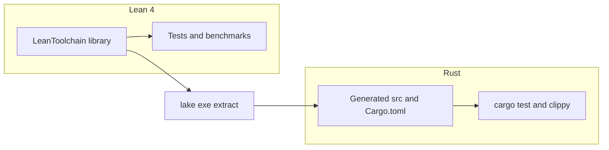

<div align="center">

<pre>
##############################################################################################
#                                                                                            #
#              _                    _____           _      _           _                     #
#             | |    ___  __ _ _ __|_   _|__   ___ | | ___| |__   __ _(_)_ __                #
#             | |   / _ \/ _` | '_ \ | |/ _ \ / _ \| |/ __| '_ \ / _` | | '_ \               #
#             | |__|  __/ (_| | | | || | (_) | (_) | | (__| | | | (_| | | | | |              #
#             |_____\___|\__,_|_| |_||_|\___/ \___/|_|\___|_| |_|\__,_|_|_| |_|              #
#                                                                                            #
#                                                                                            #
##############################################################################################
</pre>

[](https://opensource.org/licenses/MIT)
[](https://leanprover.github.io/lean4/)
[](https://github.com/SentinelOps-CI/lean-toolchain/actions/workflows/local-ci.yml)

</div>

> **Verified crypto and discrete linear algebra in Lean 4**, with **mathlib-backed** real norms where needed, and a **maintained Rust surface** produced by a template generator and checked against the same vectors as the Lean test suite.

---

## What this repository is

Lean Toolchain is a small, opinionated library for teaching and experimentation: cryptographic primitives you can read and prove against, dimension-aware vectors and matrices, and a reproducible path from Lean specifications to a `rust/` crate. It is not a certified product or a drop-in replacement for audited cryptography libraries; see [SECURITY.md](SECURITY.md) before relying on it in sensitive contexts.

---

## Capabilities

| Area | Contents |
| --- | --- |
| **Cryptography** | SHA-256 and HMAC-SHA256 on `ByteArray`, byte and hex helpers, NIST and RFC 4231 vectors in `LeanToolchain/Crypto/Tests`. |
| **Discrete math** | Length-indexed `Vec`, row–column `Matrix`, structural lemmas; real-valued norms (`ℝ`, `sqrt`) in `Norm.lean` via mathlib. |
| **Rust artifacts** | `lake exe extract` writes `rust/` from `LeanToolchain/Extraction` (template emission, not Lean term extraction). Integration tests live in `rust/tests/`. |
| **Quality bar** | No `sorry` under `LeanToolchain/` by policy (`scripts/check_sorry.sh`); local CI runs Lean and Rust gates (see [docs/development/ci.md](docs/development/ci.md)). |

---

## How the pieces fit together



---

## Quick start

**Prerequisites:** [Lean 4](https://leanprover.github.io/lean4/doc/quickstart.html) (pin in [`lean-toolchain`](lean-toolchain)) and, for Rust work, [Rust stable](https://rustup.rs/).

Clone and verify the default build and smoke tests:

```bash
git clone https://github.com/SentinelOps-CI/lean-toolchain.git
cd lean-toolchain
lake build
lake test
```

Regenerate the Rust tree and validate it (mirrors CI):

```bash
lake exe extract
cd rust
cargo test
cargo clippy --all-targets -- -D warnings
```

Optional: `lake exe cryptoTests`, `lake exe mathTests`, or `lake exe benchmarks` for focused runs.

---

## Repository layout

```
lean-toolchain/
├── LeanToolchain/     # Crypto, Math, Extraction; Tests/; Benchmarks/
├── rust/              # Generated crate (regenerate with lake exe extract)
├── docs/              # MkDocs site source (mkdocs.yml)
├── scripts/           # e.g. check_sorry.sh and sorry_allowlist.txt
├── lakefile.lean      # Lake config and mathlib require
└── lean-toolchain     # Lean release pin
```

---

## Toolchain policy

Lean is pinned in `lean-toolchain`; **mathlib** is required from `lakefile.lean` on a tag or revision that matches that Lean version. When you bump Lean, bump mathlib in lockstep and run `lake update`. Details: [CONTRIBUTING.md](CONTRIBUTING.md).

---

## Documentation

| Document | Purpose |
| --- | --- |
| [docs/index.md](docs/index.md) | Hub and how to build the MkDocs site |
| [CONTRIBUTING.md](CONTRIBUTING.md) | Contributions, `sorry` policy, PR checklist |
| [docs/development/ci.md](docs/development/ci.md) | SentinelOps vs GitHub Actions, Dependabot |
| [docs/development/extraction.md](docs/development/extraction.md) | What `lake exe extract` does and does not do |
| [docs/api/crypto.md](docs/api/crypto.md) | Crypto API and HMAC interoperability notes |
| [docs/api/math.md](docs/api/math.md) | Vectors, matrices, norms |
| [docs/vector-implementation.md](docs/vector-implementation.md) | `Vec` design notes |

Build the static site from the repository root (after `pip install mkdocs-material`):

```bash
mkdocs build -f docs/mkdocs.yml
```

---

## Security

This is a **research and teaching** codebase. Read [SECURITY.md](SECURITY.md) for threat model, reporting, and how Lean theorems relate to generated Rust.

---

## License

Distributed under the MIT License. See [LICENSE](LICENSE).

---

## Acknowledgments

[Lean 4](https://leanprover.github.io/lean4/), [mathlib4](https://github.com/leanprover-community/mathlib4), and public test material from [NIST](https://www.nist.gov/) and relevant RFCs.
